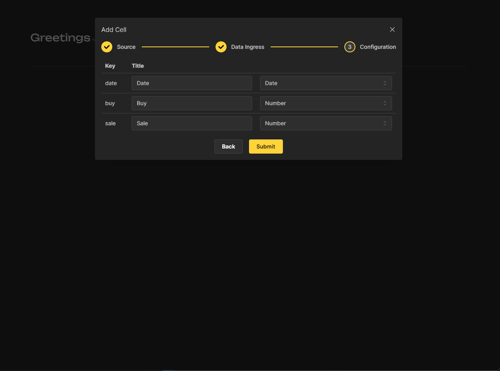
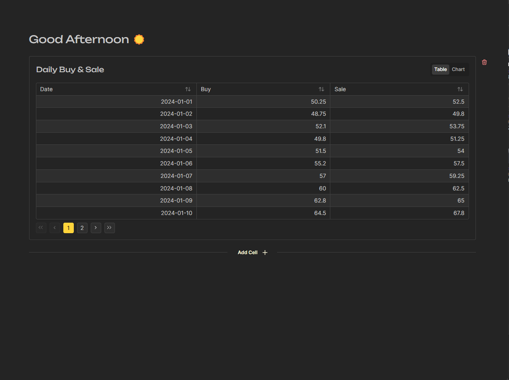
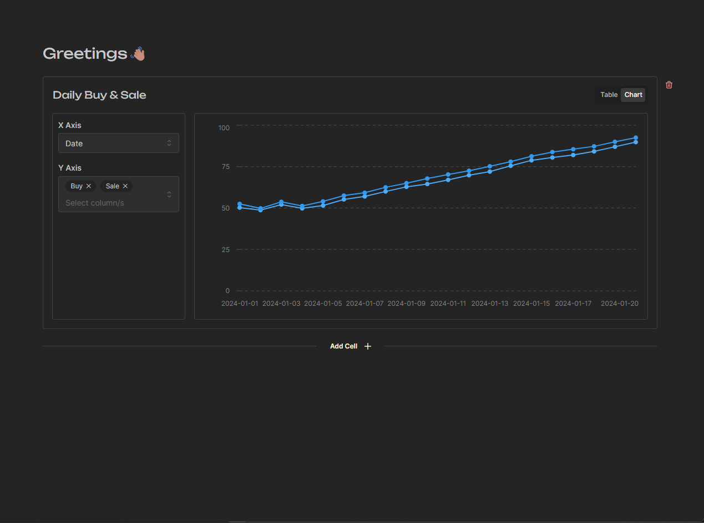

## Undata 🚧

A data visualization tools that operates in a notebook fashion. 

**Supported Sources**
- [x] JSON
- [x] CSV

### Screenshots
|Add Cell|Table View|Chart View|
|--|--|--|
||||

### Stack

||||
|:--:|:--:|:--:|
||||
|ReactJs|Mantine UI|Vite|